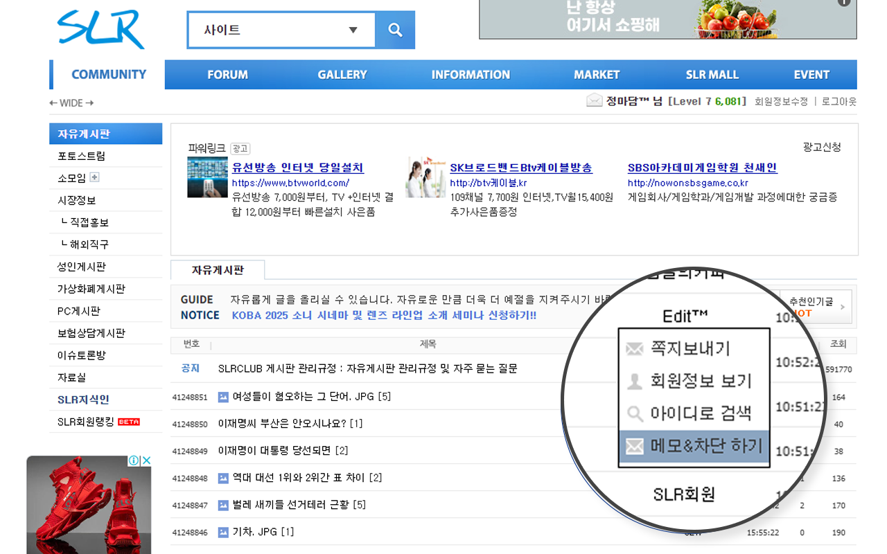
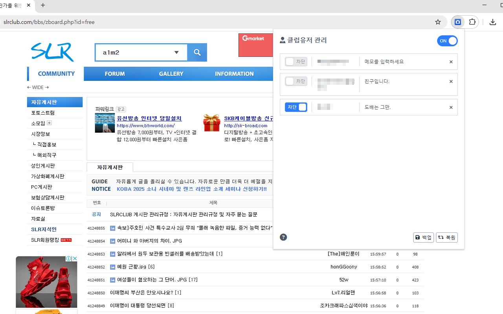

<p align="center">
  
</p>

<h1 align="center">🎬 SLRCLUB+ Chrome Extension</h1>

<p align="center">
  <strong>SLRCLUB 커뮤니티를 더 똑똑하고 쾌적하게 이용하세요!</strong><br>
  특정 사용자를 차단하고, 메모를 남기며, 다양한 편의 기능으로 커뮤니티 경험을 업그레이드합니다.
</p>

<p align="center">
  <a href="https://chromewebstore.google.com/detail/kadhpddmpkggmddeokfaiepjigojggfj">
    
  </a>
  
  
</p>

---

## ✨ 주요 기능

SLRCLUB+는 커뮤니티 활동을 더욱 편리하고 즐겁게 만들어주는 다양한 기능을 제공합니다.

| 기능 | 설명 |
| :--- | :--- |
| 🚫 **사용자 차단** | 보고 싶지 않은 사용자의 게시글과 댓글을 깔끔하게 숨깁니다. |
| 📝 **사용자 메모** | 특정 사용자에 대해 개인적인 메모를 남기고 언제든 확인할 수 있습니다. |
| 💾 **데이터 백업/복원** | 차단 목록과 메모를 JSON 파일로 백업하고 다른 브라우저에서 복원할 수 있습니다. |
| 🎲 **자동 룰렛** | 커뮤니티 내 이벤트 참여를 위한 자동 룰렛 기능을 제공합니다. |
| 👤 **회원 정보 조회** | 다른 회원의 최근 게시물을 모아보는 등 활동을 쉽게 파악할 수 있습니다. |
| 🎨 **UI 커스터마이징** | 폰트 변경, 다크 모드(준비중) 등 개인화된 UI를 설정할 수 있습니다. |
| ⌨️ **입력 편의성 개선** | 댓글 입력창 높이가 자동으로 조절되어 긴 글도 편하게 작성할 수 있습니다. |

### 🖼️ 스크린샷

<p align="center">
  
  &nbsp;&nbsp;
  
</p>

---

## 📥 설치 방법

### Chrome 웹 스토어 (권장)
1.  **[SLRCLUB+ 웹 스토어 페이지](https://chromewebstore.google.com/detail/kadhpddmpkggmddeokfaiepjigojggfj)**에 접속합니다.
2.  **"Chrome에 추가"** 버튼을 클릭합니다.
3.  권한 요청을 확인하고 **"확장프로그램 추가"**를 누르면 설치가 완료됩니다.

### 지원 브라우저
Chromium 기반의 모든 최신 브라우저를 지원합니다.
- ✅ Google Chrome
- ✅ Microsoft Edge
- ✅ Naver Whale

---

## 🚀 사용 방법

1.  **설정 열기**: 브라우저 툴바의 SLRCLUB+ 아이콘을 클릭하여 팝업을 열고, '옵션' 탭에서 기능을 활성화/비활성화할 수 있습니다.
2.  **차단 및 메모**: SLRCLUB 게시판 또는 게시물 내에서 사용자 닉네임을 클릭하면 나타나는 메뉴를 통해 사용자를 차단하거나 메모를 추가할 수 있습니다.
3.  **데이터 관리**: 팝업 메뉴의 '백업' 및 '복원' 버튼을 사용하여 데이터를 안전하게 관리하세요.

---

## 🛠 기술 스택 및 프로젝트 구조

이 프로젝트는 최신 웹 기술을 사용하여 개발되었습니다.

- **Platform**: Chrome Extension (Manifest V3)
- **Core**: HTML5, CSS3, Vanilla JavaScript
- **Styling**: Tailwind CSS, FontAwesome
- **Dependencies**:
  - `tailwindcss`: ^4.1.4
  - `@tailwindcss/cli`: ^4.1.4

### 📁 프로젝트 구조
```
slrclub/
├── manifest.json                 # Chrome 확장 프로그램 설정 파일
├── package.json                  # NPM 의존성 및 스크립트
├── README.md                     # 프로젝트 소개 문서
├── tailwind.config.js            # Tailwind CSS 설정
│
├── main/                         # 확장 프로그램의 핵심 로직
│   ├── background.js             # 서비스 워커 (이벤트 처리)
│   ├── common.js                 # 공통 유틸리티 함수
│   ├── content.js                # 웹 페이지에 삽입되는 스크립트
│   ├── popup.html & popup.js     # 툴바 아이콘 클릭 시 나타나는 팝업
│   └── options.html & options.js # 설정 페이지
│
├── js/
│   └── slrclub.js                # SLRCLUB 페이지에 직접 적용되는 로직
│
├── css/                          # 스타일시트
│   ├── slrclub.css               # 메인 커스텀 스타일
│   └── tailwind.css              # Tailwind CSS 빌드 결과물
│
├── img/                          # 로고 및 아이콘
├── _locales/                     # 다국어 지원 (ko, en)
└── guide/                        # 스크린샷 및 개인정보처리방침
```

---

## 💻 개발 가이드

### 환경 설정
```bash
# 1. 프로젝트를 클론합니다.
git clone https://github.com/kimkee/slrclub.git
cd slrclub

# 2. 의존성을 설치합니다.
npm install
```

### 개발 서버 실행
`style.css` 파일 변경 시 `tailwind.css`를 자동으로 빌드합니다.
```bash
npm run dev
```

### 로컬에서 테스트하기
1.  Chrome에서 `chrome://extensions` 페이지를 엽니다.
2.  우측 상단의 **'개발자 모드'**를 활성화합니다.
3.  **'압축해제된 확장프로그램을 로드합니다'** 버튼을 클릭하고 이 프로젝트 폴더를 선택합니다.
4.  코드를 수정한 후, 확장 프로그램 목록에서 새로고침(↻) 아이콘을 눌러 변경사항을 적용합니다.

---

## 🔒 개인정보처리방침

이 확장프로그램은 사용자의 개인정보를 **어떤 외부 서버로도 전송하거나 수집하지 않습니다.** 모든 데이터(차단 목록, 메모 등)는 사용자의 컴퓨터 내 브라우저 저장소(Chrome Storage API)에만 안전하게 보관됩니다.

자세한 내용은 **[개인정보처리방침](./guide/slrclub_privacy.md)** 문서를 참고하세요.

---

## 🤝 기여하기

버그 리포트, 기능 제안 등 어떤 형태의 기여든 환영합니다!

1.  이 저장소를 Fork합니다.
2.  새로운 기능 브랜치를 생성합니다. (`git checkout -b feature/AmazingFeature`)
3.  변경사항을 커밋합니다. (`git commit -m 'Add some AmazingFeature'`)
4.  브랜치에 푸시합니다. (`git push origin feature/AmazingFeature`)
5.  Pull Request를 생성합니다.

---

## 📄 라이센스

이 프로젝트는 [MIT License](./LICENSE)를 따릅니다.

<p align="center">
  ---
  <br>
  <em>SLRCLUB+와 함께 더 나은 커뮤니티 라이프를 즐겨보세요!</em>
</p>
